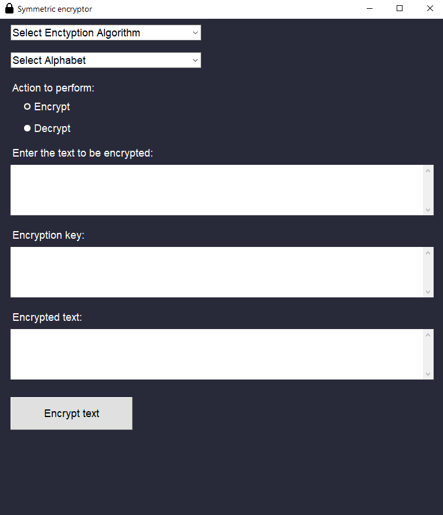
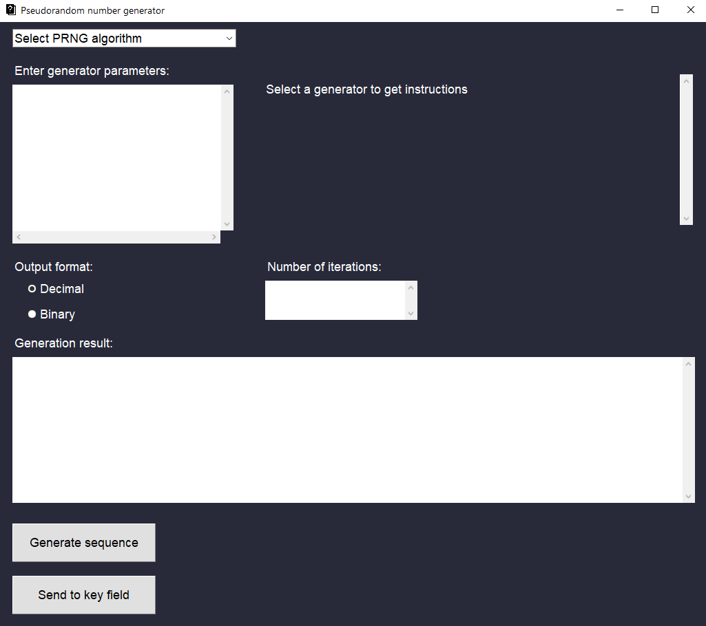

# Python Encryptor
## About the program
This program provides a graphical user interface (GUI) for encrypting and decrypting messages using various ciphers. There are more than ten ciphers of different complexity implemented in this program. The program is written in Python and utilizes the Tkinter library for building the GUI.

Available encryption algorithms: 
* Caesar
* Linear
* Affine
* Playfair
* Hill (9-characters long key)
* Vigenere
* Single permutation 
* Block permutation
* Columnar transposition 
* Double transposition
* Cardan grille (square)
* XOR (Vernam cipher)
* Feistel cipher (key - 64 bits, number of rounds - 8)

## How to use
Run `main.py`.
### Main Window
Enter the parameters for encryption and click the "Encrypt Text" button. If you enter incorrect parameters, you will receive an error. In order to encrypt the text, you need to know what keys the corresponding encryption algorithm can accept.

### PRNG Window
This windows generates sequences of bits that can later be used as a key in the main window. Just select pseudo random number generator for instructions. Enter the necessary parameters according to the instructions (each parameter must be entered on a new line), select the number of generation iterations and click "Generate sequence". To send a sequence of bits to the key field for encryption, click "Send to key field".

## Additionally
All functions for encryption are written in the "encryption_functions.py" file.
All functions for pseudo random number generators are written in the "prng_functions.py" file.